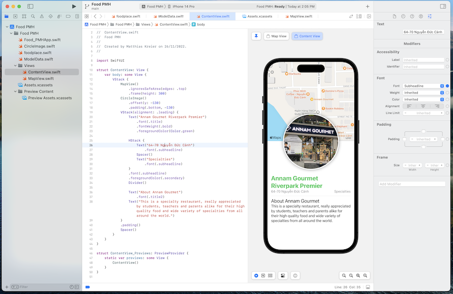

# Food-PMH
Food places around SSIS

A work-in-progress app as teaching tool for SSIS students.

## November 2022 - start of development

It is inpired by the [landscape SwiftUI tutorial](https://developer.apple.com/tutorials/swiftui/creating-and-combining-views) by Apple. We replaced iconic places in California with great restaurants near our school.

## January 2023 - Argentina update

Finally the first prototype is working:

